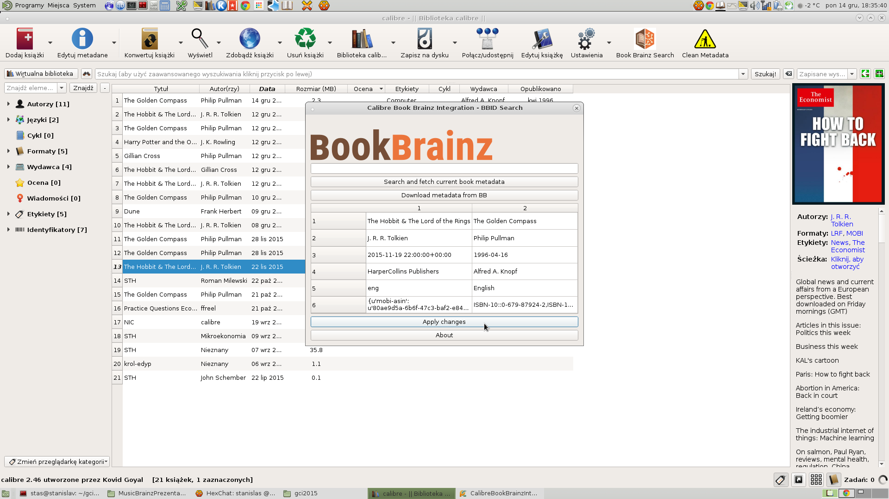

# CaliBBre
## Integration of Calibre and BookBrainz (calibre plugin).   Allows to search for metadata in BookBrainz using BBID and upload them to the selected books.
### INSTALLATION :  
Download zip file and add it to calibre like this (for v.1.0.1) :
```bash
calibre -a CaliBBre_v1.0.1.zip
```
Alternatively you can use calibre GUI (Preferences -> Plugins) and use my compressed plugin (.zip).
But after installing it that way you should restart calibre before using it.

### Screenshot:


This project was established as a part of GCI 2015.
