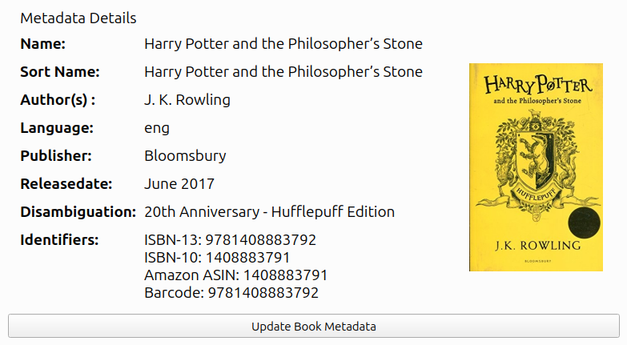
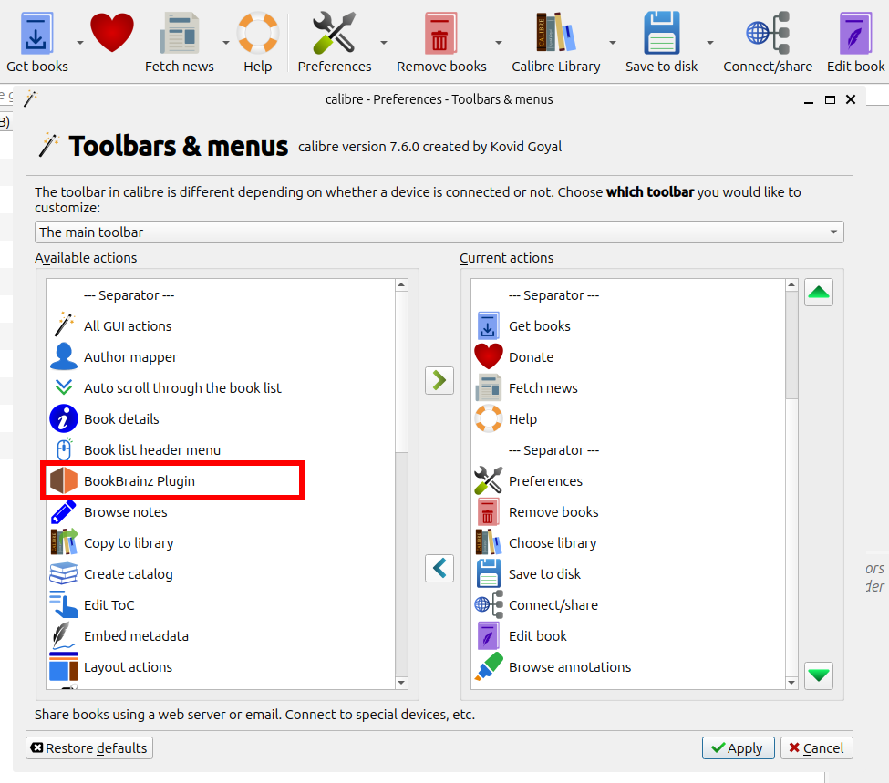

# CaliBBre
A calibre plugin for Integration with the BookBrainz API
## Features 
### Metadata Tab 
Update metadata for a selected Calibre book.<br>

 <br>

The updated metadata of the book will contain:
-  Name
-  Authors
-  Language
-  Publisher
-  Releasedate
-  Disambiguation
-  Sort Name
-  Identifiers (isbn-10, isbn-13, bbid etc)
-  Cover art from [Open Library](https://openlibrary.org/dev/docs/api/covers)


## Installation

### Option 1: From ZIP
Download the zip file and install it like this (for v.1.0.0):
```bash
calibre-customize -a CaliBBre_v1.0.0.zip
```
### Option 2: From source (clone repo)
Clone the repository and build the plugin:
```bash
git clone https://github.com/bookbrainz/CaliBBre
calibre-customize -b /path/to/CaliBBre
```

### Add the plugin to the toolbar

 <br>

1. Go to `Preferences > Toolbars & menus`
2. Select `The main toolbar` in the dropdown
3. Find and select **BookBrainz Plugin** in the Available actions
4. Click the right arrow (`->`) to add it to the toolbar
5. Click `Apply` and `Close`

The plugin can then be launched via the main toolbar


